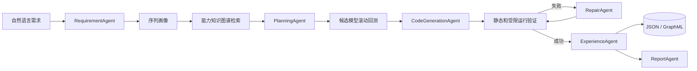

# Inventory Capability Factory

基于 AI Agent 的算法能力工厂原型系统，并选择库存预测作为具体行业场景。系统把自然语言能力需求转换为可运行的 Python 算法模块，并自动完成知识检索、方案规划、候选算法比较、验证、代码检查、失败修复、报告生成和经验沉淀。

[菜鸟—需求预测与分仓规划](https://tianchi.aliyun.com/dataset/167097)仅作为库存场景的示例数据和业务口径参考，用于验证能力工厂在真实行业数据上的闭环；项目目标不是复现或提交天池竞赛方案。

## 1. 项目背景和目标

普通算法脚本只能执行预先写好的流程。本项目针对笔试要求，实现一个可本地复现的 AI Agent 能力生产 MVP 闭环：

```text
能力描述 -> 知识检索 -> 方案规划 -> 代码生成
         -> 自动验证 -> 错误修复 -> 结果沉淀
```

能力工厂负责需求理解、知识增强规划、能力代码生成、统一验证、修复与经验回写。库存场景适配器负责预测某个商品在全国或区域仓未来 14 天的需求总量，并给出目标库存 `T`；菜鸟数据中的 A/B 公式仅作为该场景的一项业务验证指标，WAPE、sMAPE 和 Bias 作为辅助诊断指标。

## 2. 系统架构和模块设计



主要模块：

- 能力工厂核心：`agents`、`knowledge`、`codegen`、`workflow`，负责理解、检索、规划、生成、验证、修复和沉淀。
- 库存场景适配：`data`、`forecasting`、`services/benchmark.py`，负责菜鸟数据读取、需求画像、预测模型和成本回测。
- 通用验证层：`validation` 提供滚动验证和可扩展指标接口；`codegen/validator.py` 提供生成能力的接口与运行检查。

项目已从旧时序预测原型独立重构，所有核心功能均位于 `inventory_agent/`。

当前目录职责如下：

```text
inventory_agent/   核心 Python 包
tests/             自动化测试
scripts/           数据准备与项目验收脚本
docs/              设计文档与需求追踪
knowledge/         版本化基础知识图谱
examples/          可复现的演示数据与结果
data/              本地原始/处理中间数据（大文件由 Git 忽略）
```

## 3. 能力知识图谱 schema 和示例

知识图谱包含 `Algorithm`、`DemandProfile`、`Metric`、`ValidationRun` 和 `RepairStrategy` 节点，以及 `SUITABLE_FOR`、`EVALUATED_BY`、`VALIDATED`、`REPAIRED_BY` 关系。

详细说明见 [docs/knowledge_graph_schema.md](docs/knowledge_graph_schema.md)。可直接检查：

- `knowledge/base_capability_graph.json`
- `knowledge/base_capability_graph.graphml`

运行后的验证结果写入 `artifacts/knowledge/`，避免修改版本化基础图谱。

## 4. Agent 工作流设计

1. `RequirementAgent` 从中文或英文需求中提取商品、仓库、预测周期和目标。
2. 数据画像计算零需求比例、波动系数和需求类型。
3. `PlanningAgent` 从图谱检索适用算法，形成多个候选方案。
4. 库存场景验证器按 14 天窗口执行滚动回测，从 `config2.csv` 读取 A/B，并按非对称库存成本和 WAPE 排序。
5. 代码生成器为胜出模型生成标准 `forecast(history, horizon)` 模块。
6. 验证器检查语法、导入白名单、接口和受限超时子进程运行结果。
7. 失败时 `RepairAgent` 在最多两轮内重新生成已知安全模板；当前不做 LLM 级错误定位修改。
8. `ExperienceAgent` 把指标和修复记录写回知识图谱；当前历史记录尚未参与下一次模型排序。
9. `ReportAgent` 输出 JSON 和 Markdown 报告。

默认使用 Mock LLM，完全离线可复现。切换到 OpenAI 兼容接口后，LLM 参与需求理解和报告总结；模型选择仍由实际回测裁决。

## 5. 环境配置和运行方法

要求 Python 3.10-3.13，推荐使用 `uv`：

```bash
uv sync --extra dev
```

也可以使用 pip：

```bash
python -m venv .venv
pip install -r requirements.txt
```

复制环境模板：

```bash
copy .env.example .env
```

离线模式：

```dotenv
LLM_MODE=mock
```

OpenAI 兼容接口模式：

```dotenv
LLM_MODE=api
MODEL=your-model-name
BASE_URL=https://your-provider.example/v1
API_KEY=your-new-api-key
```

`.env` 已被 Git 忽略。不要把真实密钥写入 README、源码、命令行或提交记录。

环境诊断：

```bash
uv run python -m inventory_agent doctor
```

## 6. 库存场景示例数据和测试任务

原始 ZIP 和解压后的大 CSV 均不提交 Git。当前支持原始 ZIP、解压目录和带表头的演示面板 CSV。ZIP 可通过以下命令抽样：

```bash
uv run python -m inventory_agent prepare-data \
  --zip-path "C:/Users/you/Downloads/CAINIAO Part II Data_20160509.zip" \
  --items 20 \
  --output data/processed/cainiao_sample.csv
```

真实文件统计：

- 全国特征：210,549 行，963 个有历史商品，31 列。
- 分仓特征：864,772 行，963 个商品，5 个仓，32 列。
- 时间范围：2014-10-10 至 2015-12-27，共 444 天。
- 成本配置：5,778 个商品/位置键，即 963 个商品 × 全国及 5 个仓。
- 分仓观测：4,808 条实际商品/仓序列；另有 7 个成本键没有历史仓级销量，运行时按全零历史基线处理。这不等同于跨商品冷启动迁移。

字段定义见 [docs/data_schema.md](docs/data_schema.md)，库存指标契约见 [docs/inventory_evaluation.md](docs/inventory_evaluation.md)。仓库附带一个从菜鸟数据抽取的 140 天最小演示文件：`examples/data/cainiao_demo.csv`。

直接使用解压后的真实数据运行分仓任务：

```bash
uv run python -m inventory_agent run \
  --description "为商品 3424 在仓库 1 预测未来14天目标库存" \
  --data data
```

全国任务使用 `all`，系统会读取全国表而不是分仓表：

```bash
uv run python -m inventory_agent run \
  --description "为商品 3424 预测全国未来14天目标库存" \
  --data data
```

## 7. 生成算法代码示例

完整自然语言任务：

```bash
uv run python -m inventory_agent run \
  --description "为商品 3424 在仓库 1 预测未来14天需求，比较多个算法并降低补多补少成本" \
  --data examples/data/cainiao_demo.csv
```

系统会生成类似以下接口：

```python
def forecast(history: list[float], horizon: int) -> list[float]:
    series = pd.Series(history, dtype=float)
    model = default_registry().create(MODEL_NAME)
    return model.predict(series, horizon).tolist()

def build_inventory_target(history: list[float], horizon: int) -> dict:
    daily_forecast = forecast(history, horizon)
    return {"daily_forecast": daily_forecast, "target_inventory": sum(daily_forecast)}
```

真实生成文件见 `examples/complete_run/generated/forecast_last_value.py`。

生成接口保留 14 个日预测用于解释和精度诊断；对外目标库存为这些日预测之和 `target_inventory`。

## 8. 验证结果和报告样例

完整样例见：

- `examples/complete_run/validation_report.json`
- `examples/complete_run/validation_report.md`

该样例使用上传的真实目录数据，对知识图谱检索出的三个候选执行 3 折、每折 14 天的滚动回测。WAPE 等指标保持日粒度；报告中的库存成本是先聚合每折 14 天实际需求与目标库存、应用真实 A/B 后得到的平均单折成本。

若改用仓库内不含 `config2.csv` 的最小演示 CSV，报告会明确标记 `unit_default` 单位成本。使用 `--data data` 或原始 ZIP 时自动读取真实商品/位置 A/B 成本。随后对生成代码执行：

- Python 语法检查
- 导入白名单检查
- `forecast()` 和 `build_inventory_target()` 接口检查
- 删除 API Key 后的超时子进程运行检查

运行完整项目验收：

```bash
uv run python scripts/validate_project.py
```

或者分别运行：

```bash
uv run pytest --cov=inventory_agent --cov-report=term-missing
uv run ruff check inventory_agent tests scripts
```

## 9. 遇到的挑战和解决方案

- 原始 CSV 无表头：建立严格有序 schema，并在加载时验证 31/32 列。
- 多商品多仓：按 `item_id + store_code` 构造连续日序列，缺失日期按零需求补齐。
- 防止时间泄漏：采用滚动起点回测，每折只使用预测时点之前的数据。
- 间歇需求：注册 Croston，并由零需求比例驱动知识检索。
- 业务目标不同于纯精度：明确 A=补少、B=补多，并按整个 14 天库存周期计算非对称成本。
- 生成代码风险：限制导入和危险调用，在去除密钥的子进程中设置超时运行。
- API 不可用：Mock LLM 保证核心流程、测试和展示完全离线可运行。
- 全国与分仓字段不同：`all` 使用全国表，1-5 使用分仓表，通过统一位置接口处理。

## 10. 后续可扩展方向

- 基于 `A/(A+B)` 临界分位进一步进行成本感知的目标库存校准。
- 加入浏览、收藏、加购等外生特征的 pooled Gradient Boosting 模型。
- 针对 37 个无历史商品实现类目和品牌相似商品冷启动迁移。
- 抽象场景 Adapter 与验证配置，使同一能力工厂可接入异常检测、流失预测等新任务。
- 增加全国预测与五仓预测的层级一致性约束。
- 加入安全库存、在途库存和提前期，输出最终补货量。
- 增加 Streamlit 图谱和预测报告可视化。
- 将子进程执行升级为容器级资源和网络隔离沙箱。
