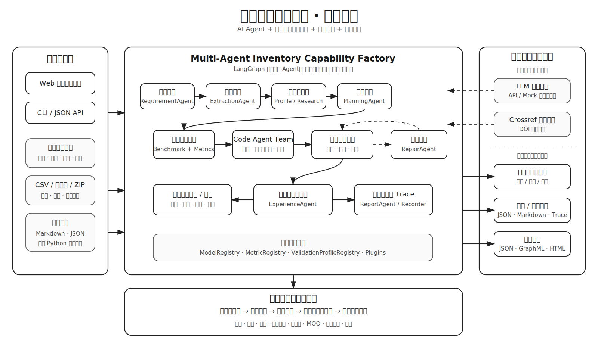
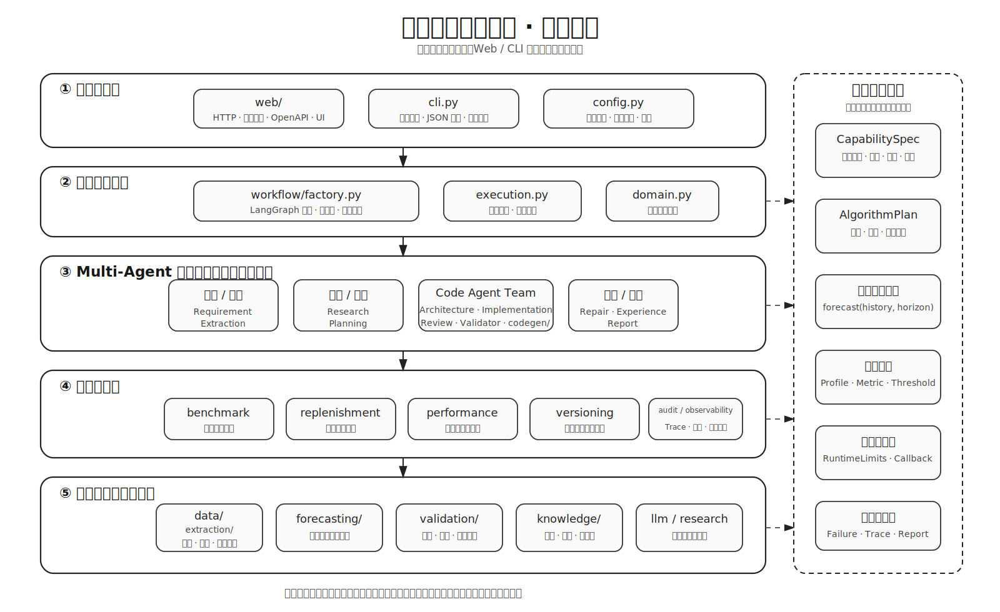
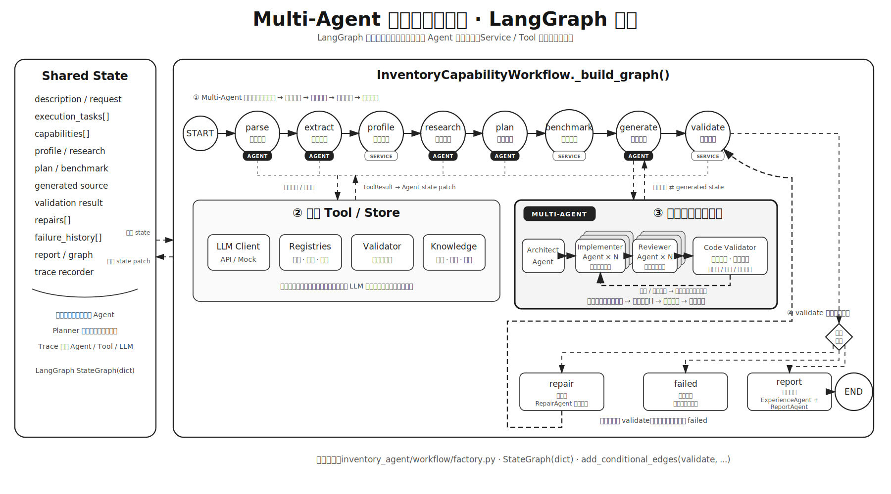

# Inventory Capability Factory

> 面向本科阶段实践的库存预测 Multi-Agent 项目，重点实现算法能力抽取、代码生成、自动验证和知识沉淀。

针对“Agent 能否把算法资料转化为可运行代码”这一问题，该项目将流程拆分为“**能力抽取 → 能力复刻 → 能力验证 → 能力沉淀**”四个阶段，并选择库存预测作为具体场景。系统可以从结构化文档、JSON 和本地 Python 代码中整理算法能力，再根据自然语言需求进行候选算法比较、代码生成、验证和修复。开发过程中采用 AI 辅助理解资料、修改代码和检查文档；模块划分、业务口径、测试用例和最终取舍则通过代码、配置与运行记录体现，便于后续检查和复现。

[菜鸟—需求预测与分仓规划](https://tianchi.aliyun.com/dataset/167097)仅作为库存预测的数据格式与业务指标参考，用于验证能力工厂在真实行业数据上的闭环；本项目不是天池竞赛方案复现。

## 快速查看

| 想检查的内容 | 推荐入口 |
|---|---|
| 端到端综合展示 | [高级能力展示索引](examples/advanced_showcase/README.md) |
| 多场景自动测试 | [运行结果](examples/acceptance/acceptance_report.md) |
| Agent、Tool、LLM 调用过程 | [最新高级用例与 Trace 索引](examples/advanced_showcase/README.md) |
| 代码自动修复闭环 | [修复过程示例](examples/repair_run/README.md) |
| 生成算法代码与多候选审查 | [独立复刻结果](examples/replication_run/) |
| 知识图谱可视化 | [完整能力图谱](examples/knowledge_graph/complete_capability_graph.html) |
| 项目功能与实现边界 | [功能实现清单](docs/requirements_traceability.md) |
| 自动检查结果 | [项目自检报告](docs/evaluation_acceptance_matrix.md) |

最短体验路径：

```bash
uv sync --extra dev
uv run python -m inventory_agent doctor
uv run python -m inventory_agent web --open-browser
```

默认使用可完全离线复现的 Mock LLM。Web 默认地址为 `http://127.0.0.1:8000`，API 文档位于 `http://127.0.0.1:8000/api/docs`。

## README 导航

1. [项目背景和目标](#1-项目背景和目标)
2. [系统架构和模块设计](#2-系统架构和模块设计)
3. [能力知识图谱 schema 和示例](#3-能力知识图谱-schema-和示例)
4. [Agent 工作流设计](#4-agent-工作流设计)
5. [环境配置和运行方法](#5-环境配置和运行方法)
6. [库存场景示例数据和测试任务](#6-库存场景示例数据和测试任务)
7. [生成算法代码示例](#7-生成算法代码示例)
8. [验证结果和报告样例](#8-验证结果和报告样例)
9. [遇到的挑战和解决方案](#9-遇到的挑战和解决方案)
10. [后续可扩展方向](#10-后续可扩展方向)

## 1. 项目背景和目标

普通算法脚本通常只执行预先写好的流程。针对算法资料难以持续复用、生成代码缺少统一验证、失败经验难以沉淀等问题，该项目采用可在本地复现的 Agent 工作流，使系统能够自动整理能力、生成实现、运行验证并保留失败经验：

```text
文档/代码 -> 能力抽取 -> CapabilitySpec -> 知识图谱
自然语言需求 -> 检索与规划 -> 架构Agent -> 多实现Agent -> 审查Agent
             -> 自动验证/等价性检查 -> 错误修复 -> 版本沉淀
```

其中，Agent 部分负责需求理解、知识检索、方案规划、代码生成、验证和修复；库存场景部分负责预测某个商品在全国或区域仓的未来需求并给出目标库存 `T`。如果数据中还有库存快照，系统会进一步结合现货、在途、欠单、安全库存、MOQ、包装倍数和仓容计算建议补货量。菜鸟数据中的 A/B 公式作为库存业务指标，WAPE、sMAPE 和 Bias 用来辅助观察预测误差。

项目设计目标：

- **先保证能运行**：抽取结果会继续进入规划、生成和验证，而不只是输出一段摘要。
- **过程尽量可追踪**：保存来源哈希、源码哈希、Agent/Tool 事件、验证结果和版本事件。
- **方便复现**：默认 Mock 模式不依赖外部 API，仓库内提供小型数据、测试和运行结果。
- **留出扩展位置**：模型、指标、验证配置和插件通过注册表接入，减少散落的硬编码。
- **兼顾两类读者**：业务报告尽量少用技术术语，技术报告保留算法指标和代码检查细节。

## 2. 系统架构和模块设计

### 2.1 系统架构



系统分为用户输入、Multi-Agent 主流程、外部服务和库存预测场景四个部分。外部 LLM 或 Crossref 不可用时可以降级；生成代码、业务/技术报告和知识图谱都会保存在运行目录中，方便之后查看。

### 2.2 模块设计



模块依赖自上而下：接口层只负责输入输出适配，LangGraph 工作流负责状态和路由，Agent 层负责理解、规划、生成、审查、修复和沉淀，应用服务承载确定性业务规则，领域与基础设施提供数据、预测、验证、图谱和 LLM 适配能力。各层通过共享领域契约交互。

### 2.3 代码目录

主要模块：

- 能力工厂核心：`extraction`、`agents`、`knowledge`、`codegen`、`workflow`，负责来源解析、规格化、检索、规划、生成、验证、修复和沉淀。
- 库存场景适配：`data`、`forecasting`、`services/benchmark.py`、`services/replenishment.py`，负责菜鸟与通用数据读取、需求画像、预测模型、成本回测和约束补货建议。
- 通用验证层：`validation` 提供滚动验证、`ValidationProfileRegistry` 任务配置和 `MetricRegistry` 指标插件；`codegen/validator.py` 提供生成能力的接口、稳定性与受限运行检查。

项目已从旧时序预测原型独立重构，所有核心功能均位于 `inventory_agent/`。

当前目录职责如下：

```text
inventory_agent/   核心 Python 包
tests/             自动化测试
scripts/           数据准备、示例生成与项目自检脚本
docs/              设计文档与需求追踪
knowledge/         版本化基础知识图谱
examples/          可复现的演示数据与结果
data/              本地原始/处理中间数据（大文件由 Git 忽略）
```

更详细的模块依赖、提交/忽略边界和安全清理方法见
[docs/project_structure.md](docs/project_structure.md)；精选示例的用途见
[examples/README.md](examples/README.md)；手绘风格的系统架构、模块设计和完整
Agent 工作流图见 [docs/architecture_diagrams.md](docs/architecture_diagrams.md)。

## 3. 能力知识图谱 schema 和示例

知识图谱包含 `Algorithm`、`SourceArtifact`、`CapabilityVersion`、`VersionEvent`、`DemandProfile`、`Metric`、`ValidationRun`、`FailureCase` 和 `RepairStrategy` 节点。算法节点保留输入输出、适用条件、依赖、参数、模板、来源哈希和版本；运行节点与实际生成源码版本、归一化失败和修复策略建立关联。

| 知识层 | 主要节点 | 解决的问题 |
|---|---|---|
| 来源层 | `SourceArtifact` | 能力来自哪个文档、JSON 或代码文件，内容哈希是什么 |
| 能力层 | `Algorithm`、`DemandProfile`、`Metric` | 算法适用于什么需求画像，使用哪些指标和参数 |
| 验证层 | `ValidationRun`、`FailureCase`、`RepairStrategy` | 是否真实运行通过，为什么失败，如何修复 |
| 版本层 | `CapabilityVersion`、`VersionEvent` | 哪份源码被验证、发布、替换或回滚 |

核心设计和证据文档：

- [知识图谱 schema](docs/knowledge_graph_schema.md)
- [能力抽取、复刻、验证与沉淀](docs/capability_extraction.md)
- [Multi-Agent 代码协作](docs/multi_agent_code_collaboration.md)
- [联网研究、搜索优化与自修复](docs/online_research_and_optimization.md)
- [执行耗时与资源分析](docs/performance_and_runtime.md)
- [库存预测业务场景](docs/business/inventory_forecasting_scenario.md)
- [执行 Trace 与历史文件清理](docs/execution_trace.md)
- [高级组合用例](docs/advanced_showcase_cases.md)
- [项目能力自查](docs/scoring_alignment.md)
- [CLI/Web 共用功能检查](docs/evaluation_acceptance_matrix.md)

可直接检查的图谱文件：

- `knowledge/base_capability_graph.json`
- `knowledge/base_capability_graph.graphml`
- `knowledge/base_capability_graph.html`
- `knowledge/extracted_capabilities.json`
- `knowledge/extracted_external_capabilities.json`
- `knowledge/capability_spec.schema.json`
- `examples/knowledge_graph/complete_capability_graph.html`

当前示例使用 schema `1.5`。本次刷新后的基础图谱包含 **18 个节点、35 条关系**；
带验证、失败、修复及版本生命周期的完整图谱包含 **28 个节点、48 条关系**。节点与关系的
契约、版本演进、约束和实际统计见[知识图谱 schema 文档](docs/knowledge_graph_schema.md)。

运行后的验证结果写入 `artifacts/knowledge/`，避免修改版本化基础图谱。

生成无需外部 JavaScript 依赖的 HTML 可视化。页面采用来源、算法、画像、指标和运行版本的
分层布局，支持搜索、类型筛选、缩放拖动、关系名称开关、关联边高亮和节点属性侧栏：

```bash
uv run python -m inventory_agent visualize-graph \
  --knowledge knowledge/base_capability_graph.json \
  --output artifacts/knowledge/capability_graph.html
```

工作流每次成功或最终失败时也会同步保存 JSON、GraphML 和 HTML。HTML 中按节点类型着色，并展示算法、需求画像、指标、验证记录和修复策略之间的关系。

## 4. Agent 工作流设计



本项目采用**基于 LangGraph 共享状态的分层 Multi-Agent 混合架构**：外层使用确定性状态图保证可复现和可审计；代码生成阶段局部采用 Orchestrator–Workers，以有界线程池并行生成、独立审查和验证多个候选；验证失败后通过 Evaluator–Optimizer 回环进入 `RepairAgent`。它不是由单个 LLM Supervisor 自由决定所有路由的开放式架构，LLM 不能绕过确定性验证门禁。

| 协作层次 | 架构模式 | 作用 |
|---|---|---|
| 外层业务流程 | LangGraph Stateful Workflow | 固定主链、共享状态、条件路由、终止条件 |
| 任务规划 | Plan-and-Execute | 生成用户可见任务、候选模型、验证指标和发布门禁 |
| 代码生成 | Orchestrator–Workers / Fan-out–Fan-in | 架构蓝图、并行实现、并行审查、并行验证和汇聚选优 |
| 失败修复 | Evaluator–Optimizer | 错误分类、经验检索、受预算约束修复和重新验证 |
| Agent 通信 | Shared State / Blackboard | 通过结构化 state patch 交换结果，而不是依赖不可审计的长对话 |

一次完整运行包含以下阶段：

1. `CapabilityExtractionAgent` 从 Markdown、JSON、文本或 Python AST 抽取 `CapabilitySpec`，记录来源文件、SHA-256、依赖、参数和版本；API 模式可用 LLM 规范化非结构化文档。
2. 抽取结果写入 JSON，并通过 `EXTRACTED_FROM` 关系摄取到知识图谱。
3. `RequirementAgent` 从中文或英文需求中提取商品、仓库、预测周期和目标；数据画像计算需求类型。
4. `PlanningAgent` 从图谱检索适用算法，结合历史验证经验形成多个候选方案。
5. 验证配置注册表使用能力规格中的同一组超参数，按库存成本或预测精度执行无时间泄漏的滚动回测并选择能力；仅已注册的可执行能力进入自动回测。
6. `CodeArchitectureAgent` 先根据胜出 `CapabilitySpec` 形成算法步骤、接口、边界、依赖、性能目标和风险蓝图，不直接生成代码。
7. 一个或多个 `CodeImplementationAgent` 按不同策略独立生成自包含实现，`CodeReviewAgent` 再逐份审查并可返回完整修订源码；Mock 模式执行对应的确定性角色实现。
8. 验证器检查审查后源码的语法、导入、接口、边界输入、确定性、受限运行，并在周期、间歇、趋势和全零需求上与参考能力做数值等价比较。LLM 审查结论不能替代验证门禁。
9. 失败时先生成类别和稳定指纹，从图谱检索同模型、同类失败的历史成功修复经验；`RepairAgent` 最多修复两轮，API 模式先结合错误和历史经验修复源码，仍失败则回退安全规格模板；所有版本重新验证。
10. `ExperienceAgent` 将指标、验证检查、修复记录、协作方式和生成源码哈希写入 `ValidationRun` 与 `CapabilityVersion`，供后续排序复用。
11. `ReportAgent` 输出业务 Markdown、技术 Markdown 和 JSON，展示库存/补货建议、角色协作记录、抽取来源、规格哈希、源码哈希、生成模式和等价性误差。

默认使用 Mock LLM，依靠确定性抽取器、架构蓝图、安全模板和静态检查离线运行。切换到 OpenAI 兼容接口后，LLM 会分别承担架构、实现和审查角色，也可以参与非结构化文档整理、失败修复和报告总结；最终采用哪个模型、生成代码是否可用，仍由回测结果和统一验证器决定。

API 模式下，最终代码不再只生成一个实现：系统会把业务请求、需求画像、能力规格、设计依据和
主验证指标一起交给代码生成 Agent，按照规格忠实、边界鲁棒、最小依赖等不同策略生成最多 5 份
独立源码。每份源码都禁止调用项目内部注册模型，并分别经过语法、导入安全、接口、受限运行、
稳定性和参考行为等价验证；系统从通过门禁的候选中按运行耗时、代码规模和确定性规则选出最终版本。
Mock 模式仍只生成一份模板实现，以保证离线测试完全可复现。

新抽取但尚未注册实现的算法会保留在知识图谱中，状态相当于“待人工接入/审核”，不会被误送入自动回测。当前全自动闭环覆盖五个内置库存预测能力；新算法可先由 API 模式生成，再经人工确认接口和注册后进入同一验证闭环，属于半自动扩展路径。

## 5. 环境配置和运行方法

### 5.1 安装依赖

要求 Python 3.10-3.13，推荐使用 `uv`：

```bash
uv sync --extra dev
```

也可以使用 pip：

```bash
python -m venv .venv
pip install -r requirements.txt
```

### 5.2 配置 LLM

复制环境模板：

```bash
cp .env.example .env
```

离线模式：

```dotenv
LLM_MODE=mock
```

OpenAI 兼容接口模式：

```dotenv
LLM_MODE=api
MODEL=your-model-name
BASE_URL=https://your-provider.example/v1
API_KEY=your-new-api-key
```

`.env` 已被 Git 忽略。不要把真实密钥写入 README、源码、命令行或提交记录。

### 5.3 环境诊断与 Web

环境诊断：

```bash
uv run python -m inventory_agent doctor
```

检查核心代码、示例和文档是否齐全；发现必需文件缺失时返回非零退出码：

```bash
uv run python -m inventory_agent audit --strict
```

同一结果也显示在 Web 的“项目自检”页面。需要重新生成 Markdown 检查报告时：

```bash
uv run python -m inventory_agent audit \
  --format markdown \
  --output docs/evaluation_acceptance_matrix.md \
  --strict
```

启动本地 Web 工作台：

```bash
uv run python -m inventory_agent web --open-browser
```

默认访问地址与自动接口文档：

```text
Web：http://127.0.0.1:8000
API 文档：http://127.0.0.1:8000/api/docs
OpenAPI JSON：http://127.0.0.1:8000/api/openapi.json
```

接口文档由服务端路由目录自动生成，POST 请求分发也复用同一目录，减少接口实现和文档不一致。
Web 使用方式见 [`docs/web_interface.md`](docs/web_interface.md)，自然语言示例和测试用例见
[`docs/usage_examples_and_test_cases.md`](docs/usage_examples_and_test_cases.md)。

### 5.4 外部 LLM 与联网研究检查

实际验证外部 LLM，而不只是检查环境变量：

```bash
uv run python -m inventory_agent doctor --live-llm
```

可选联网行业研究会从 Crossref 检索 DOI 元数据，生成
`online_knowledge_extraction.json`，并将证据用于候选规划、代码生成与修复上下文：

```bash
uv run python -m inventory_agent run --description "为商品 1003 在仓库 1 预测未来14天间歇需求" --data examples/business_data/demand_history.csv --online-research
```

CLI 支持 `doctor`、`audit`、`prepare-sample`、`research-industry`、`extract-capability`、`replicate-capability`、`versions`、`benchmark`、`run`、`visualize-graph`、`plugins` 和 `web`。使用 `--verbose` 可查看不包含密钥的工作流进度日志。

### 5.5 能力抽取、独立复刻与版本管理

递归扫描当前本地代码仓库，抽取五个预测能力、输出扫描诊断并更新知识图谱：

```bash
uv run python -m inventory_agent extract-capability \
  --source . \
  --output knowledge/extracted_capabilities.json \
  --knowledge knowledge/base_capability_graph.json
```

不运行完整库存业务流程，也可以单独复刻一个能力并生成 JSON/Markdown 审核清单：

```bash
uv run python -m inventory_agent replicate-capability \
  --source examples/capabilities/moving_average.md \
  --output-dir artifacts/replication/generated \
  --manifest artifacts/replication/review_manifest.json \
  --candidates 3
```

有注册参考实现时会自动执行四组数值等价验证；没有参考实现时即使安全和运行检查通过，也只会标记为 `review_required`。审核人可在确认算法语义后显式增加 `--approve`，该决定会写入审核清单。

查看、比较、发布或回滚验证后的能力版本：

```bash
uv run python -m inventory_agent versions list \
  --knowledge artifacts/knowledge/capability_graph.json \
  --model moving_average

uv run python -m inventory_agent versions promote \
  --knowledge artifacts/knowledge/capability_graph.json \
  --model moving_average \
  --version SOURCE_HASH_PREFIX
```

版本状态包括 `candidate`、`active`、`superseded` 和 `rejected`，每次发布或回滚都会生成可审计的 `VersionEvent`。

### 5.6 完整工作流与 Trace

完整打印并保存一次 Agent 工作流的所有主要中间过程：

```bash
uv run python -m inventory_agent run \
  --description "为商品 3424 在仓库 1 预测未来14天目标库存" \
  --data examples/data/cainiao_demo.csv \
  --capability-source examples/capabilities/moving_average.md \
  --output-root artifacts/runs \
  --trace-level full \
  --keep-runs 10
```

`full` 模式会额外生成每个候选算法的独立代码并逐一验证。每次运行输出 `detailed_trace.jsonl`、`detailed_trace.md`、`run_manifest.json`、候选代码目录、最终代码、修复版本快照和验证报告。`--keep-runs` 只会清理输出根目录下符合时间戳命名规则的旧任务目录，不会删除手工命名目录或其他项目文件。

## 6. 库存场景示例数据和测试任务

面向业务用户和开发人员的完整示例、预期结果与测试用例见：

- [使用示例与测试用例](docs/usage_examples_and_test_cases.md)

| 数据入口 | 内容 | 适合验证 |
|---|---|---|
| [`examples/data/cainiao_demo.csv`](examples/data/cainiao_demo.csv) | 从菜鸟格式抽取的轻量面板数据 | 最短预测、回测和报告流程 |
| [`examples/business_data/`](examples/business_data/) | 需求历史、商品主数据、库存快照、补货策略和事件 | 约束补货、多商品、多仓与业务报告 |
| `data/` | 用户本地菜鸟三表、解压目录或原始 ZIP | 真实大数据目录识别、全国/分仓预测和 A/B 成本 |
| [`examples/capabilities/`](examples/capabilities/) | 五种可抽取算法能力文档 | 能力抽取、复刻和知识图谱摄取 |

原始 ZIP 和解压后的大 CSV 均不提交 Git。当前支持原始 ZIP、解压目录和带表头的演示面板 CSV。已经在 `data/` 放置解压文件时可直接运行工作流，无需执行数据准备命令；只有原始 ZIP 或需要轻量样本时，才使用可选命令：

```bash
uv run python -m inventory_agent prepare-sample \
  --zip-path "C:/Users/you/Downloads/CAINIAO Part II Data_20160509.zip" \
  --items 20 \
  --output data/processed/cainiao_sample.csv
```

真实文件统计：

- 全国特征：210,549 行，963 个有历史商品，31 列。
- 分仓特征：864,772 行，963 个商品，5 个仓，32 列。
- 时间范围：2014-10-10 至 2015-12-27，共 444 天。
- 成本配置：5,778 个商品/位置键，即 963 个商品 × 全国及 5 个仓。
- 分仓观测：4,808 条实际商品/仓序列；另有 7 个成本键没有历史仓级销量，运行时按全零历史基线处理。这不等同于跨商品冷启动迁移。

字段定义见 [docs/data_schema.md](docs/data_schema.md)，库存指标契约见 [docs/inventory_evaluation.md](docs/inventory_evaluation.md)。仓库附带一个从菜鸟数据抽取的 140 天最小演示文件：`examples/data/cainiao_demo.csv`。

此外，`examples/business_data/` 提供可随 Git 分发的确定性合成业务数据：6 个商品、3 个仓库、
2880 条需求历史，并包含商品主数据、库存快照、补货策略和需求事件。它覆盖稳定、周期、间歇、
趋势、波动和冷启动需求。工作流会自动读取同目录的库存快照与补货策略，把预测目标转换为考虑
现货、在途、欠单、安全库存、最小订货量、包装倍数和仓容的建议补货量。字段关系见
[docs/business/data_contract.md](docs/business/data_contract.md)。

重新生成并校验这套业务材料：

```bash
uv run python scripts/generate_business_demo.py
```

直接在合成多仓数据上运行：

```bash
uv run python -m inventory_agent run \
  --description "为商品 1002 在仓库 1 预测未来14天目标库存" \
  --data examples/business_data/demand_history.csv \
  --trace-level full
```

直接使用解压后的真实数据运行分仓任务：

```bash
uv run python -m inventory_agent run \
  --description "为商品 3424 在仓库 1 预测未来14天目标库存" \
  --data data
```

全国任务使用 `all`，系统会读取全国表而不是分仓表：

```bash
uv run python -m inventory_agent run \
  --description "为商品 3424 预测全国未来14天目标库存" \
  --data data
```

## 7. 生成算法代码示例

从能力文档到可运行代码的完整任务：

```bash
uv run python -m inventory_agent run \
  --description "为商品 3424 在仓库 1 预测未来14天目标库存，并复刻能力文档中的算法" \
  --data examples/data/cainiao_demo.csv \
  --capability-source examples/capabilities/moving_average.md
```

系统会生成类似以下接口：

```python
def forecast(history: list[float], horizon: int) -> list[float]:
    series = _clean_history(history, horizon)
    window = min(int(PARAMETERS.get("window", 14)), len(series))
    return [float(series.iloc[-window:].mean())] * horizon

def build_inventory_target(history: list[float], horizon: int) -> dict:
    daily_forecast = forecast(history, horizon)
    return {"daily_forecast": daily_forecast, "target_inventory": sum(daily_forecast)}
```

可直接检查的真实生成代码：[forecast_last_value.py](examples/complete_run/generated/forecast_last_value.py)。多候选版本及其架构蓝图、协作清单见 [replication_run/generated](examples/replication_run/generated/)。

来源文档进入完整业务流程的结果见 `examples/extraction_run/`；独立复刻和审核清单见 `examples/replication_run/`；包含 17 个 Agent/工具/LLM 事件和三个候选代码方案的详细运行示例见 `examples/detailed_run/`；菜鸟格式数据运行结果见 `examples/complete_run/`；首次验证失败后自动修复成功的过程见 `examples/repair_run/`；包含来源、失败、修复、版本和发布事件的完整图谱见 `examples/knowledge_graph/`。

重新生成外部知识抽取、修复闭环和完整图谱证据：

```bash
uv run python scripts/generate_submission_examples.py
```

生成接口保留 14 个日预测用于解释和精度诊断；对外目标库存为这些日预测之和 `target_inventory`。

## 8. 验证结果和报告样例

完整样例见：

- [面向业务用户的库存与补货报告](examples/complete_run/business_report.md)
- [包含算法和代码检查细节的技术报告](examples/complete_run/validation_report.md)
- [机器可读验证数据](examples/complete_run/validation_report.json)
- [首次失败并自动修复成功的精选证据](examples/repair_run/README.md)
- [最新 Multi-Agent 高级用例与详细 Trace](examples/advanced_showcase/README.md)

该样例使用上传的真实目录数据，对知识图谱检索出的三个候选执行 3 折、每折 14 天的滚动回测。WAPE 等指标保持日粒度；报告中的库存成本是先聚合每折 14 天实际需求与目标库存、应用真实 A/B 后得到的平均单折成本。

若改用仓库内不含 `config2.csv` 的最小演示 CSV，报告会明确标记 `unit_default` 单位成本。使用 `--data data` 或原始 ZIP 时自动读取真实商品/位置 A/B 成本。随后对生成代码执行：

- Python 语法检查
- 导入白名单检查
- `forecast()` 和 `build_inventory_target()` 接口检查
- 全零历史、短预测周期和相同输入重复执行的稳定性检查
- 与参考算法预测结果的数值等价性检查
- 删除 API Key 后的超时子进程运行检查与运行耗时记录

运行完整项目自检：

```bash
uv run python scripts/validate_project.py
```

该脚本会执行完整测试、Ruff、至少 80% 的覆盖率门禁、真实本地仓库能力抽取、独立代码复刻、
完整 Agent 工作流、业务/技术报告、知识图谱、版本发布以及 Web/API 文档一致性检查。

单独重新生成多场景测试报告：

```bash
uv run python scripts/run_acceptance_cases.py
```

生成结果见 `examples/acceptance/acceptance_report.{json,md}`，覆盖六类需求画像、约束补货、
多商品/所有仓库解析、能力复刻、自动修复、知识图谱生命周期和 API 文档一致性。

或者分别运行：

```bash
uv run pytest --cov=inventory_agent --cov-report=term-missing
uv run ruff check inventory_agent tests scripts
```

## 9. 遇到的挑战和解决方案

- 原始 CSV 无表头：建立严格有序 schema，并在加载时验证 31/32 列。
- 多商品多仓：按 `item_id + store_code` 构造连续日序列，缺失日期按零需求补齐。
- 防止时间泄漏：采用滚动起点回测，每折只使用预测时点之前的数据。
- 间歇需求：注册 Croston，并由零需求比例驱动知识检索。
- 业务目标不同于纯精度：明确 A=补少、B=补多，并按整个 14 天库存周期计算非对称成本。
- 生成代码风险：限制导入和危险调用，在去除密钥的子进程中设置超时运行。
- 能力来源不可审计：统一抽取为 `CapabilitySpec`，保存来源路径、SHA-256、抽取方式和版本。
- 生成代码只是包装器：改为按能力参数渲染自包含算法实现，并把参考模型等价性作为必要检查。
- 结果难以对应源码：每次运行生成 `CapabilityVersion`，关联规格哈希、源码哈希、验证结果和修复记录。
- 验证目标差异：通过插件式 `ValidationProfileRegistry` 分离库存成本任务和日需求精度任务的排序规则。
- 经验无法复用：将验证次数、成功率和平均库存成本汇总为检索排序依据，同时保留原始验证节点便于审计。
- API 不可用：Mock LLM 保证核心流程、测试和展示完全离线可运行。
- 全国与分仓字段不同：`all` 使用全国表，1-5 使用分仓表，通过统一位置接口处理。
- 预测值不等于采购量：当库存快照和补货策略存在时，单独的补货决策层应用库存位置、安全库存、MOQ、包装倍数和仓容；缺少业务输入时明确回退为公式，不虚构下单量。

## 10. 后续可扩展方向

- 基于 `A/(A+B)` 临界分位进一步进行成本感知的目标库存校准。
- 针对无历史或短历史商品实现类目、品牌和相似商品冷启动迁移。
- 抽象场景 Adapter，使同一能力工厂可接入异常检测、流失预测等新任务；当前可插拔的是库存预测内部的验证配置。
- 增加全国预测与五仓预测的层级一致性约束。
- 增加供应商可供量、预算、采购日历、运输时效分布和跨仓调拨优化。
- 在现有 Web 工作台上增加任务队列、用户权限和多人审核流程。
- 将子进程执行升级为容器级资源和网络隔离沙箱。
