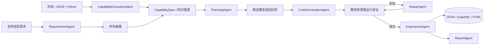

# Inventory Capability Factory

基于 AI Agent 的算法能力工厂原型系统，并选择库存预测作为具体行业场景。系统能够从结构化文档、JSON 和真实 Python 代码中抽取带来源的能力规格，再把自然语言需求转换为可运行的 Python 算法模块，自动完成知识摄取、方案规划、候选算法比较、规格驱动代码生成、等价性验证、失败修复、报告生成和版本化经验沉淀。

[菜鸟—需求预测与分仓规划](https://tianchi.aliyun.com/dataset/167097)仅作为库存场景的示例数据和业务口径参考，用于验证能力工厂在真实行业数据上的闭环；项目目标不是复现或提交天池竞赛方案。

## 1. 项目背景和目标

普通算法脚本只能执行预先写好的流程。本项目针对笔试要求，实现一个可本地复现的 AI Agent 能力生产 MVP 闭环：

```text
文档/代码 -> 能力抽取 -> CapabilitySpec -> 知识图谱
自然语言需求 -> 检索与规划 -> 规格驱动代码生成
             -> 自动验证/等价性检查 -> 错误修复 -> 版本沉淀
```

能力工厂负责需求理解、知识增强规划、能力代码生成、统一验证、修复与经验回写。库存场景适配器负责预测某个商品在全国或区域仓未来 14 天的需求总量，并给出目标库存 `T`；菜鸟数据中的 A/B 公式仅作为该场景的一项业务验证指标，WAPE、sMAPE 和 Bias 作为辅助诊断指标。

## 2. 系统架构和模块设计



主要模块：

- 能力工厂核心：`extraction`、`agents`、`knowledge`、`codegen`、`workflow`，负责来源解析、规格化、检索、规划、生成、验证、修复和沉淀。
- 库存场景适配：`data`、`forecasting`、`services/benchmark.py`，负责菜鸟数据读取、需求画像、预测模型和成本回测。
- 通用验证层：`validation` 提供滚动验证、`ValidationProfileRegistry` 任务配置和 `MetricRegistry` 指标插件；`codegen/validator.py` 提供生成能力的接口、稳定性与受限运行检查。

项目已从旧时序预测原型独立重构，所有核心功能均位于 `inventory_agent/`。

当前目录职责如下：

```text
inventory_agent/   核心 Python 包
tests/             自动化测试
scripts/           数据准备与项目验收脚本
docs/              设计文档与需求追踪
knowledge/         版本化基础知识图谱
examples/          可复现的演示数据与结果
data/              本地原始/处理中间数据（大文件由 Git 忽略）
```

## 3. 能力知识图谱 schema 和示例

知识图谱包含 `Algorithm`、`SourceArtifact`、`CapabilityVersion`、`VersionEvent`、`DemandProfile`、`Metric`、`ValidationRun`、`FailureCase` 和 `RepairStrategy` 节点。算法节点保留输入输出、适用条件、依赖、参数、模板、来源哈希和版本；运行节点与实际生成源码版本、归一化失败和修复策略建立关联。

抽取、复刻、验证和版本沉淀说明见 [docs/capability_extraction.md](docs/capability_extraction.md)，图谱结构见 [docs/knowledge_graph_schema.md](docs/knowledge_graph_schema.md)，库存业务场景见 [docs/business/inventory_forecasting_scenario.md](docs/business/inventory_forecasting_scenario.md)，权威资料清单见 [docs/references.md](docs/references.md)，详细中间过程和自动清理说明见 [docs/execution_trace.md](docs/execution_trace.md)，按笔试四类评分标准整理的运行证据见 [docs/scoring_alignment.md](docs/scoring_alignment.md)。可直接检查：

- `knowledge/base_capability_graph.json`
- `knowledge/base_capability_graph.graphml`
- `knowledge/base_capability_graph.html`
- `knowledge/extracted_capabilities.json`
- `knowledge/extracted_external_capabilities.json`
- `knowledge/capability_spec.schema.json`
- `examples/knowledge_graph/complete_capability_graph.html`

运行后的验证结果写入 `artifacts/knowledge/`，避免修改版本化基础图谱。

生成无需外部 JavaScript 依赖的 HTML 可视化。页面采用来源、算法、画像、指标和运行版本的
分层布局，支持搜索、类型筛选、缩放拖动、关系名称开关、关联边高亮和节点属性侧栏：

```bash
uv run python -m inventory_agent visualize-graph \
  --knowledge knowledge/base_capability_graph.json \
  --output artifacts/knowledge/capability_graph.html
```

工作流每次成功或最终失败时也会同步保存 JSON、GraphML 和 HTML。HTML 中按节点类型着色，并展示算法、需求画像、指标、验证记录和修复策略之间的关系。

## 4. Agent 工作流设计

1. `CapabilityExtractionAgent` 从 Markdown、JSON、文本或 Python AST 抽取 `CapabilitySpec`，记录来源文件、SHA-256、依赖、参数和版本；API 模式可用 LLM 规范化非结构化文档。
2. 抽取结果写入 JSON，并通过 `EXTRACTED_FROM` 关系摄取到知识图谱。
3. `RequirementAgent` 从中文或英文需求中提取商品、仓库、预测周期和目标；数据画像计算需求类型。
4. `PlanningAgent` 从图谱检索适用算法，结合历史验证经验形成多个候选方案。
5. 验证配置注册表使用能力规格中的同一组超参数，按库存成本或预测精度执行无时间泄漏的滚动回测并选择能力；仅已注册的可执行能力进入自动回测。
6. `SafeCodeGenerator` 根据胜出 `CapabilitySpec` 生成自包含实现；API 模式可让 LLM 首次生成，Mock 模式使用可审计模板。生成代码不再只是调用注册表的薄包装。
7. 验证器检查语法、导入、接口、边界输入、确定性、受限运行，并在周期、间歇、趋势和全零需求上将生成输出与参考能力进行数值等价性比较。
8. 失败时先生成类别和稳定指纹，从图谱检索同模型、同类失败的历史成功修复经验；`RepairAgent` 最多修复两轮，API 模式先结合错误和历史经验修复源码，仍失败则回退安全规格模板；所有版本重新验证。
9. `ExperienceAgent` 将指标、验证检查、修复记录和生成源码哈希写入 `ValidationRun` 与 `CapabilityVersion`，供后续排序复用。
10. `ReportAgent` 输出 JSON 和 Markdown，展示抽取来源、规格哈希、源码哈希、生成模式和等价性误差。

默认使用 Mock LLM，依靠确定性抽取器和安全模板完全离线复现。切换到 OpenAI 兼容接口后，LLM 可参与非结构化文档抽取、首次代码生成、失败修复和报告总结；模型选择及生成代码验收仍由实际回测和统一验证器裁决。

新抽取但尚未注册实现的算法会保留在知识图谱中，状态相当于“待人工接入/审核”，不会被误送入自动回测。当前全自动闭环覆盖五个内置库存预测能力；新算法可先由 API 模式生成，再经人工确认接口和注册后进入同一验证闭环，属于半自动扩展路径。

## 5. 环境配置和运行方法

要求 Python 3.10-3.13，推荐使用 `uv`：

```bash
uv sync --extra dev
```

也可以使用 pip：

```bash
python -m venv .venv
pip install -r requirements.txt
```

复制环境模板：

```bash
copy .env.example .env
```

离线模式：

```dotenv
LLM_MODE=mock
```

OpenAI 兼容接口模式：

```dotenv
LLM_MODE=api
MODEL=your-model-name
BASE_URL=https://your-provider.example/v1
API_KEY=your-new-api-key
```

`.env` 已被 Git 忽略。不要把真实密钥写入 README、源码、命令行或提交记录。

环境诊断：

```bash
uv run python -m inventory_agent doctor
```

CLI 支持 `doctor`、`prepare-sample`、`extract-capability`、`replicate-capability`、`versions`、`benchmark`、`run` 和 `visualize-graph`。使用 `--verbose` 可查看不包含密钥的工作流进度日志。

递归扫描当前本地代码仓库，抽取五个预测能力、输出扫描诊断并更新知识图谱：

```bash
uv run python -m inventory_agent extract-capability \
  --source . \
  --output knowledge/extracted_capabilities.json \
  --knowledge knowledge/base_capability_graph.json
```

不运行完整库存业务流程，也可以单独复刻一个能力并生成 JSON/Markdown 审核清单：

```bash
uv run python -m inventory_agent replicate-capability \
  --source examples/capabilities/moving_average.md \
  --output-dir artifacts/replication/generated \
  --manifest artifacts/replication/review_manifest.json
```

有注册参考实现时会自动执行四组数值等价验证；没有参考实现时即使安全和运行检查通过，也只会标记为 `review_required`。审核人可在确认算法语义后显式增加 `--approve`，该决定会写入审核清单。

查看、比较、发布或回滚验证后的能力版本：

```bash
python -m inventory_agent versions list \
  --knowledge artifacts/knowledge/capability_graph.json \
  --model moving_average

python -m inventory_agent versions promote \
  --knowledge artifacts/knowledge/capability_graph.json \
  --model moving_average \
  --version SOURCE_HASH_PREFIX
```

版本状态包括 `candidate`、`active`、`superseded` 和 `rejected`，每次发布或回滚都会生成可审计的 `VersionEvent`。

完整打印并保存一次 Agent 工作流的所有主要中间过程：

```bash
python -m inventory_agent run \
  --description "为商品 3424 在仓库 1 预测未来14天目标库存" \
  --data examples/data/cainiao_demo.csv \
  --capability-source examples/capabilities/moving_average.md \
  --output-root artifacts/runs \
  --trace-level full \
  --keep-runs 10
```

`full` 模式会额外生成每个候选算法的独立代码并逐一验证。每次运行输出 `detailed_trace.jsonl`、`detailed_trace.md`、`run_manifest.json`、候选代码目录、最终代码、修复版本快照和验证报告。`--keep-runs` 只会清理输出根目录下符合时间戳命名规则的旧任务目录，不会删除手工命名目录或其他项目文件。

## 6. 库存场景示例数据和测试任务

原始 ZIP 和解压后的大 CSV 均不提交 Git。当前支持原始 ZIP、解压目录和带表头的演示面板 CSV。已经在 `data/` 放置解压文件时可直接运行工作流，无需执行数据准备命令；只有原始 ZIP 或需要轻量样本时，才使用可选命令：

```bash
uv run python -m inventory_agent prepare-sample \
  --zip-path "C:/Users/you/Downloads/CAINIAO Part II Data_20160509.zip" \
  --items 20 \
  --output data/processed/cainiao_sample.csv
```

真实文件统计：

- 全国特征：210,549 行，963 个有历史商品，31 列。
- 分仓特征：864,772 行，963 个商品，5 个仓，32 列。
- 时间范围：2014-10-10 至 2015-12-27，共 444 天。
- 成本配置：5,778 个商品/位置键，即 963 个商品 × 全国及 5 个仓。
- 分仓观测：4,808 条实际商品/仓序列；另有 7 个成本键没有历史仓级销量，运行时按全零历史基线处理。这不等同于跨商品冷启动迁移。

字段定义见 [docs/data_schema.md](docs/data_schema.md)，库存指标契约见 [docs/inventory_evaluation.md](docs/inventory_evaluation.md)。仓库附带一个从菜鸟数据抽取的 140 天最小演示文件：`examples/data/cainiao_demo.csv`。

此外，`examples/business_data/` 提供可随 Git 分发的确定性合成业务数据：6 个商品、3 个仓库、
2880 条需求历史，并包含商品主数据、库存快照、补货策略和需求事件。它覆盖稳定、周期、间歇、
趋势、波动和冷启动需求，字段关系见 [docs/business/data_contract.md](docs/business/data_contract.md)。

重新生成并校验这套业务材料：

```bash
python scripts/generate_business_demo.py
```

直接在合成多仓数据上运行：

```bash
python -m inventory_agent run \
  --description "为商品 1002 在仓库 1 预测未来14天目标库存" \
  --data examples/business_data/demand_history.csv \
  --trace-level full
```

直接使用解压后的真实数据运行分仓任务：

```bash
uv run python -m inventory_agent run \
  --description "为商品 3424 在仓库 1 预测未来14天目标库存" \
  --data data
```

全国任务使用 `all`，系统会读取全国表而不是分仓表：

```bash
uv run python -m inventory_agent run \
  --description "为商品 3424 预测全国未来14天目标库存" \
  --data data
```

## 7. 生成算法代码示例

从能力文档到可运行代码的完整任务：

```bash
uv run python -m inventory_agent run \
  --description "为商品 3424 在仓库 1 预测未来14天目标库存，并复刻能力文档中的算法" \
  --data examples/data/cainiao_demo.csv \
  --capability-source examples/capabilities/moving_average.md
```

系统会生成类似以下接口：

```python
def forecast(history: list[float], horizon: int) -> list[float]:
    series = _clean_history(history, horizon)
    window = min(int(PARAMETERS.get("window", 14)), len(series))
    return [float(series.iloc[-window:].mean())] * horizon

def build_inventory_target(history: list[float], horizon: int) -> dict:
    daily_forecast = forecast(history, horizon)
    return {"daily_forecast": daily_forecast, "target_inventory": sum(daily_forecast)}
```

来源文档到完整业务流程的结果见 `examples/extraction_run/`；独立复刻和审核清单见 `examples/replication_run/`；包含 17 个 Agent/工具/LLM 事件和三个候选代码方案的教师评审运行包见 `examples/detailed_run/`；真实菜鸟目录数据运行结果见 `examples/complete_run/`；首次验证失败后自动修复成功的证据见 `examples/repair_run/`；包含来源、失败、修复、版本和发布事件的完整图谱见 `examples/knowledge_graph/`。

重新生成外部知识抽取、修复闭环和完整图谱证据：

```bash
python scripts/generate_submission_examples.py
```

生成接口保留 14 个日预测用于解释和精度诊断；对外目标库存为这些日预测之和 `target_inventory`。

## 8. 验证结果和报告样例

完整样例见：

- `examples/complete_run/validation_report.json`
- `examples/complete_run/validation_report.md`

该样例使用上传的真实目录数据，对知识图谱检索出的三个候选执行 3 折、每折 14 天的滚动回测。WAPE 等指标保持日粒度；报告中的库存成本是先聚合每折 14 天实际需求与目标库存、应用真实 A/B 后得到的平均单折成本。

若改用仓库内不含 `config2.csv` 的最小演示 CSV，报告会明确标记 `unit_default` 单位成本。使用 `--data data` 或原始 ZIP 时自动读取真实商品/位置 A/B 成本。随后对生成代码执行：

- Python 语法检查
- 导入白名单检查
- `forecast()` 和 `build_inventory_target()` 接口检查
- 全零历史、短预测周期和相同输入重复执行的稳定性检查
- 与参考算法预测结果的数值等价性检查
- 删除 API Key 后的超时子进程运行检查与运行耗时记录

运行完整项目验收：

```bash
uv run python scripts/validate_project.py
```

或者分别运行：

```bash
uv run pytest --cov=inventory_agent --cov-report=term-missing
uv run ruff check inventory_agent tests scripts
```

## 9. 遇到的挑战和解决方案

- 原始 CSV 无表头：建立严格有序 schema，并在加载时验证 31/32 列。
- 多商品多仓：按 `item_id + store_code` 构造连续日序列，缺失日期按零需求补齐。
- 防止时间泄漏：采用滚动起点回测，每折只使用预测时点之前的数据。
- 间歇需求：注册 Croston，并由零需求比例驱动知识检索。
- 业务目标不同于纯精度：明确 A=补少、B=补多，并按整个 14 天库存周期计算非对称成本。
- 生成代码风险：限制导入和危险调用，在去除密钥的子进程中设置超时运行。
- 能力来源不可审计：统一抽取为 `CapabilitySpec`，保存来源路径、SHA-256、抽取方式和版本。
- 生成代码只是包装器：改为按能力参数渲染自包含算法实现，并以参考模型等价性作为验收门槛。
- 结果难以对应源码：每次运行生成 `CapabilityVersion`，关联规格哈希、源码哈希、验证结果和修复记录。
- 验证目标差异：通过插件式 `ValidationProfileRegistry` 分离库存成本任务和日需求精度任务的排序规则。
- 经验无法复用：将验证次数、成功率和平均库存成本汇总为检索排序依据，同时保留原始验证节点便于审计。
- API 不可用：Mock LLM 保证核心流程、测试和展示完全离线可运行。
- 全国与分仓字段不同：`all` 使用全国表，1-5 使用分仓表，通过统一位置接口处理。

## 10. 后续可扩展方向

- 基于 `A/(A+B)` 临界分位进一步进行成本感知的目标库存校准。
- 加入浏览、收藏、加购等外生特征的 pooled Gradient Boosting 模型。
- 针对 37 个无历史商品实现类目和品牌相似商品冷启动迁移。
- 抽象场景 Adapter，使同一能力工厂可接入异常检测、流失预测等新任务；当前可插拔的是库存预测内部的验证配置。
- 增加全国预测与五仓预测的层级一致性约束。
- 加入安全库存、在途库存和提前期，输出最终补货量。
- 在现有静态 HTML 图谱基础上增加 Streamlit 交互式预测报告。
- 将子进程执行升级为容器级资源和网络隔离沙箱。
